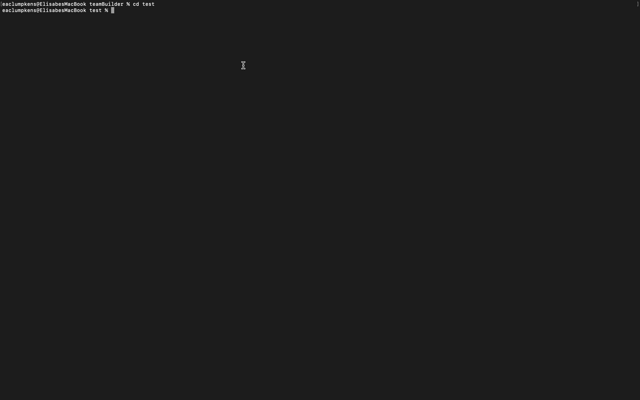

# Team Builder
[](https://opensource.org/licenses)

```
AS a manager 
I WANT to generate a webpage that displays my team's basic info 
SO THAT I have quick accesss to emails and GitHub profiles
```

## Table of Contents

[Demo](#demo)

[Installation](#installation)

[Usage](#usage)

[Contribution](#contribution)

[Tests](#tests)

[Images](#images)

[Questions](#questions)

----
<a name="demo"></a>
### Demo

[video app demo](https://youtu.be/ZC5hbyM5xIU)

<a name="installation"></a>
### Installation

In order to utilize the generator you must install node and it's dependencies.

1. `git clone` this repository
2. `npm init`
3. `npm i fs`, `npm i inquirer`, `npm i path`, `npm i jest`
4. `node app`
5. `npm run test` to pass tests

<a name="usage"></a>
### Usage

* Uses [inquirer npm package](https://github.com/SBoudrias/Inquirer.js/) to prompt  user for their email, id, and specific information based on their role with the company - an intern may provide their school, whereas an engineer may provide their GitHub username.

* App runs as a Node CLI to gather information about each employee.

<a name="contribution"></a>
### Contribution

Single contribution project 

<a name="tests"></a>
### Tests

Pass `npm run test` to validate employee information

<a name="images"></a>
### Images

##### Command Line Demo


##### App Demo


##### Test Demo


----

<a name="questions"></a>
### Questions
##### Contact Me

Feel free to contact me via GitHub or email with any feedback - thanks for checking out my code!

[GitHub u/eaclumpkens](https://github.com/eaclumpkens)
eaclumpkens@gmail.com
